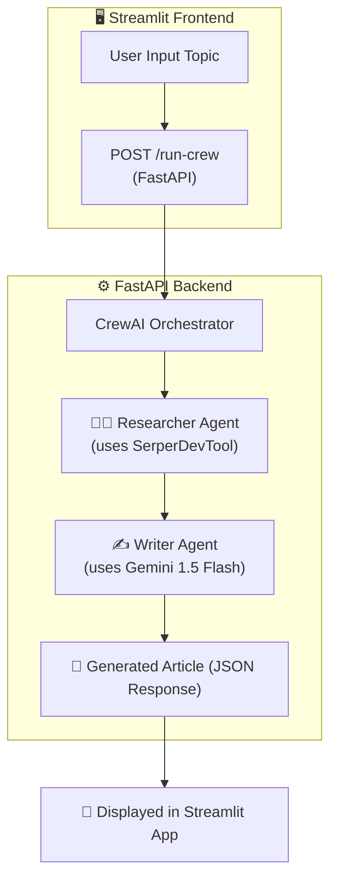

# 🚀 TechSage Crew: The Autonomous Tech Intelligence Collective

> *“Autonomous AI agents researching, analyzing, and narrating the future of technology — now with an interactive Streamlit frontend and FastAPI backend.”*

---

## 🤩 Overview

**TechSage Crew** is a dual-layer intelligent AI system combining a **FastAPI backend** and a **Streamlit web interface**.  
Built with **CrewAI**, **Gemini 1.5 Flash**, and **Serper Search**, it autonomously performs real-time research and content generation.

This project forms an *autonomous newsroom crew* — where:
- 🧑‍🔬 **Researcher Agent** analyzes the latest tech trends using live web data.  
- ✍️ **Writer Agent** crafts engaging, human-like articles based on those findings.  
- 🌐 **FastAPI Backend** orchestrates agent execution and exposes an API endpoint.  
- 🖥️ **Streamlit Frontend** provides a user-friendly UI for anyone to run the agents visually.

---

## 🤓 Problem Statement

In today’s fast-moving tech landscape, staying current with accurate, research-driven content is time-consuming and repetitive.

**Challenges include:**
- Manual research from vast online sources  
- Maintaining factual accuracy and consistency  
- Repetitive article formatting  
- Lack of real-time intelligence updates  

---

## 💡 Proposed Solution (TechSage Crew)

**TechSage Crew** automates research and writing by using **autonomous AI agents** connected through a clean API and interactive UI.

**Solution Highlights:**
1. 🧠 *Autonomous Agents* — Researcher + Writer work collaboratively.  
2. 🌐 *Real-Time Knowledge* — Uses **SerperDevTool** for live Google search.  
3. ✍️ *Content Generation* — **Gemini 1.5 Flash** creates high-quality articles.  
4. ⚙️ *FastAPI Backend* — Handles all agent orchestration and topic input dynamically.  
5. 🖥️ *Streamlit Frontend* — Lets any user run CrewAI visually with one click.  

---

## 🤩 System Architecture



---

## ⚙️ Setup & Installation

### 1️⃣ Clone the Repository
```bash
git clone https://github.com/riyad1721/techsage-crew.git
cd techsage-crew
```

### 2️⃣ Create a Virtual Environment
```bash
python -m venv venv
source venv/bin/activate      # Linux/macOS
venv\Scripts\activate         # Windows
```

### 3️⃣ Install Dependencies
```bash
pip install -r requirements.txt
```

### 4️⃣ Configure Environment Variables

Create a `.env` file in the project root:
```env
GOOGLE_API_KEY=your_gemini_api_key
SERPER_API_KEY=your_serper_api_key
```
> 💡 Get Gemini API keys from [Google AI Studio](https://aistudio.google.com/), and Serper API key from [https://serper.dev](https://serper.dev)

---

## 🗂️ Project Structure

```
techsage-crew/
├── agent_pipeline/
│   ├── agents.py          # Researcher & Writer agent definitions
│   ├── tasks.py           # Task configuration
│   ├── crew.py            # Crew orchestration logic
│   ├── tools.py           # Serper Search Tool setup
│   └── __init__.py
├── main.py                # FastAPI backend
├── streamlit_app/
│   └── app.py             # Streamlit web UI
├── .env
├── requirements.txt
└── README.md
```

---

## ▶️ Running the Project

### 🧠 Start the Backend (FastAPI)
```bash
uvicorn main:app --reload --port 8000
```
✅ API will be available at → [http://127.0.0.1:8000/docs](http://127.0.0.1:8000/docs)

You can test directly:
```bash
curl -X POST http://127.0.0.1:8000/run-crew \
     -H "Content-Type: application/json" \
     -d '{"topic": "AI in Healthcare"}'
```

### 🖥️ Start the Frontend (Streamlit)
Open another terminal and run:
```bash
streamlit run streamlit_app/app.py
```
Then open → [http://localhost:8501](http://localhost:8501)

---

## 💻 Streamlit Features

| Feature | Description |
|----------|--------------|
| 🤩 **Input Field** | Enter any topic dynamically |
| 🚀 **Run Button** | Triggers FastAPI `/run-crew` endpoint |
| ⏳ **Progress Spinner** | Shows while CrewAI agents run |
| 🧠 **Result Display** | Outputs research + article in paragraph format |
| 💾 **Backend Integration** | Fetches data from local FastAPI server |
| 📊 **Sidebar Info** | Project details and author information |

---

## 🧰 Technologies Used

| Component | Description |
|------------|--------------|
| 🧠 **CrewAI** | Framework for multi-agent orchestration |
| 💬 **Gemini 1.5 Flash** | Google’s LLM for reasoning & writing |
| 🌐 **SerperDevTool** | Google search integration for live data |
| ⚙️ **FastAPI** | High-performance backend framework |
| 🖥️ **Streamlit** | Interactive frontend for users |
| 🔑 **dotenv** | Secure environment configuration |
| 🐍 **Python 3.10+** | Core programming language |

---

## 🧪 Example Flow

**Input:**  
```json
{"topic": "AI in Healthcare"}
```

**Process:**  
1. FastAPI calls CrewAI pipeline → Researcher gathers insights → Writer creates article.  
2. Streamlit UI waits and displays the response.

**Output:**  
> AI in Healthcare is transforming modern medicine through faster diagnostics, personalized treatments, and data-driven decision-making across hospitals worldwide.

---

## 🔬 Future Enhancements

- [ ] Multi-Agent Review & Fact Checking  
- [ ] Streaming output updates in UI  
- [ ] PDF / Markdown export button  
- [ ] Offline LLM support via Ollama  
- [ ] User session history and analytics  

---

## 👨‍💻 Author

**Md. Reyad Hossain**  
AI Engineer | Developer of *TechSage Crew*  
📧 [reyadhasan7254@gmail.com](mailto:reyadhasan7254@gmail.com)  
🔗 [Portfolio](#) • [LinkedIn](#) • [GitHub](#)

---

> *“Empowering AI to research, think, and write — together.”*

